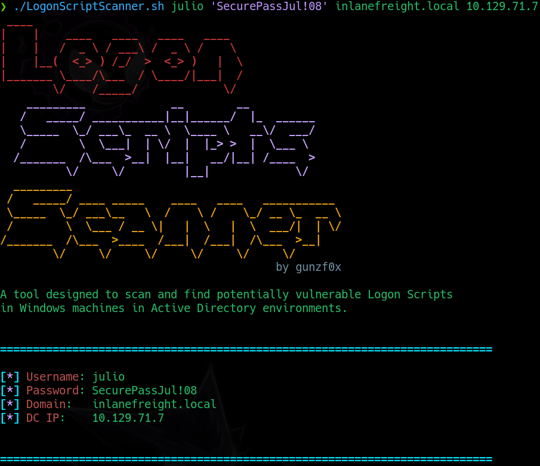

# LogonScriptsScanner

A simple tool to analyze `NETLOGON` share and check if it can be abused to move laterally on Windows machines.

---

## Pre-requisites
1. We need a valid user of an Active Directory domain and its credentials (password in plain text).
2. This tools needs 4 other tools to work:

- `bloodyAD`
- `rpcclient`
- `smbcacls`
- `smbclient`

To install `bloodyAD` just execute in a terminal:

```shell-session
❯ sudo apt update -y
❯ sudo apt-get install libkrb5-dev -y
❯ pip3 install bloodyAD
```
or, under your own risk,
```shell-session
❯ pip3 install bloodyAD --break-system-packages
```

To install `rpcclient`, `smbcacls` and `smbclient` execute in a terminal:
```shell-session
sudo apt update -y && sudo apt install smbclient -y
```

## Usage
Use the credentials of a valid user in the domain to extract info about potential Logon Scripts that could lead to lateral movement:
```shell-session
❯ ./LogonScriptScanner.sh <USER> <PASSWORD> <DOMAIN> <IP>
```

For example:
```shell-session
❯ ./LogonScriptScanner.sh julio 'SecurePassJul!08' inlanefreight.local 10.129.71.7
```




---

## Disclaimer
Use this tool for ethical purposes only (:
